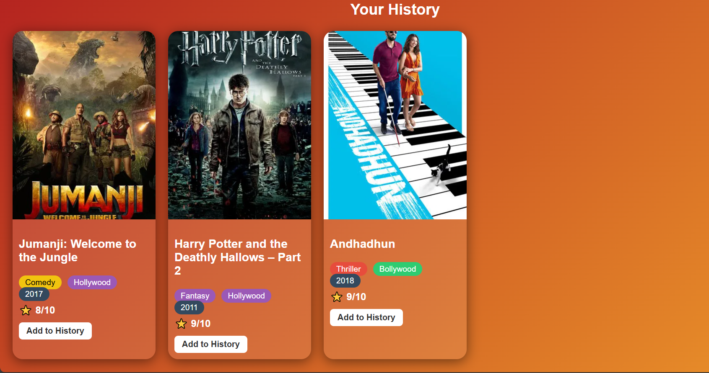
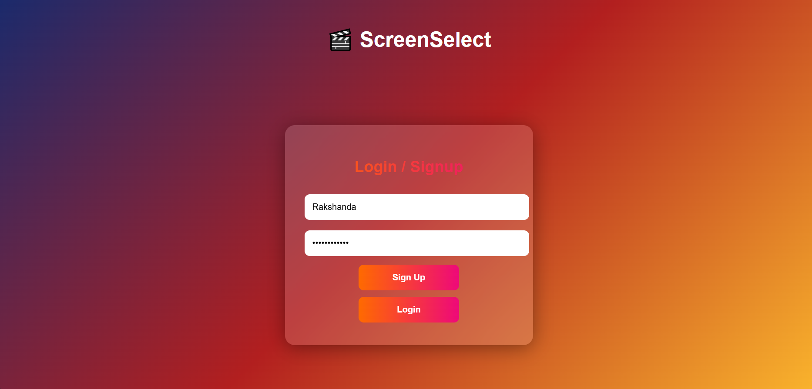
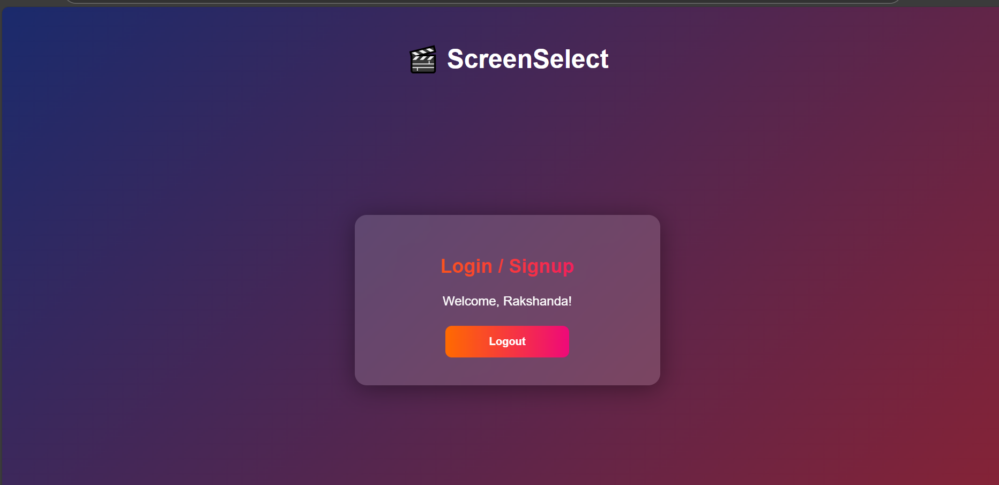
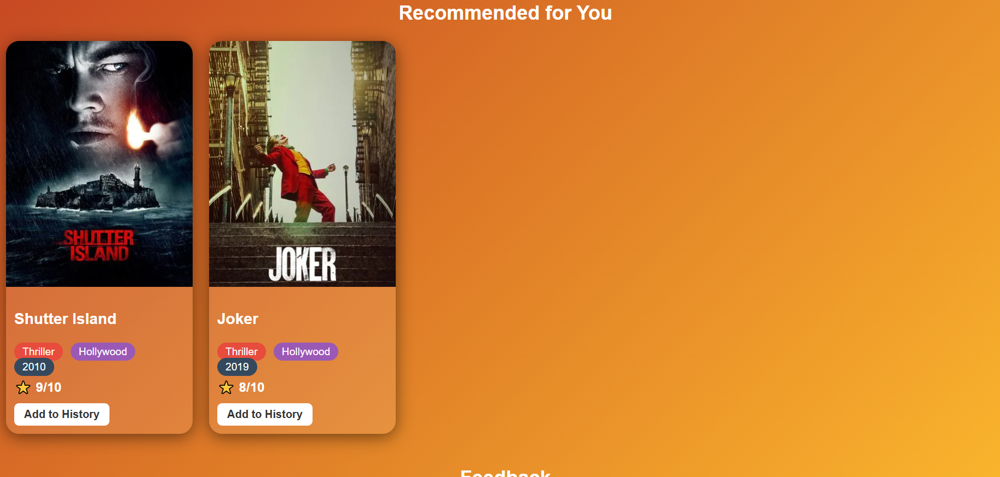
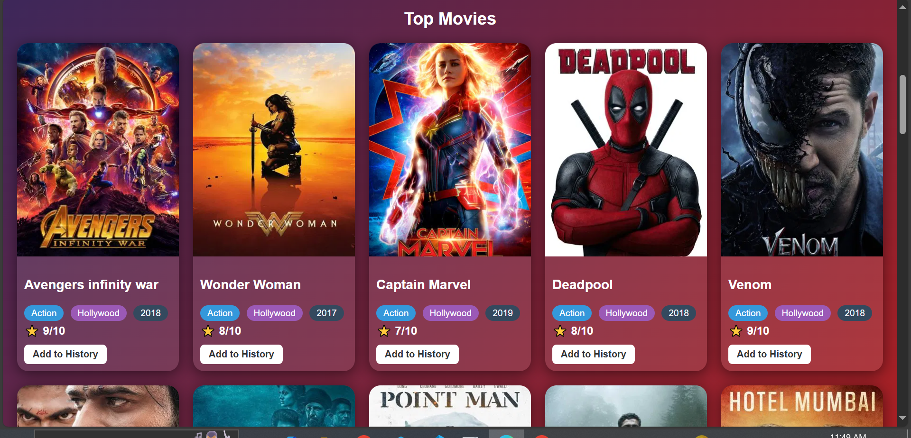

# Screen_Select

Screen_Select is a simple Movie Recommendation System built with a C++ backend (k-d tree) and a modern HTML/CSS/JS frontend.  
It recommends movies based on user history, allows signup/login, and displays real posters fetched from TMDB API.  

## Screenshots

  
  
  

  
  

---
##  Features
-  Eye-catching gradient UI  
- Colored genre/type/year badges  
-  Original posters via TMDB API (with fallback placeholders)  
-  Add-to-History button  
-  User history saved per account  
-  Personalized recommendations (based on history)  
-  Signup/Login system (localStorage)  
-  Password must be 8+ characters with letters & numbers 
- Feedback buttons 

